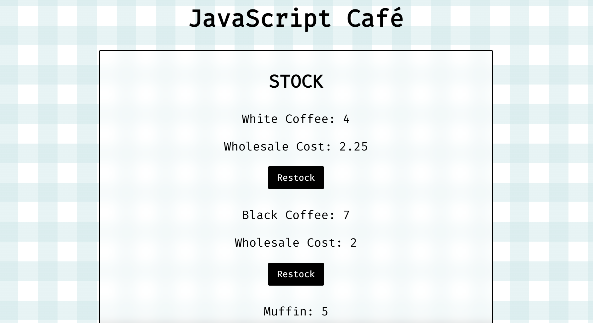

# JavaScript Café

## Screenshot

A small café simulation built with **JavaScript, HTML, and CSS** that demonstrates DOM manipulation, inventory management, and transaction logic.

The application generates random customer orders, calculates totals, processes transactions, manages stock levels, and allows products to be restocked using café cash.
---

## Features

- Generate random customer orders
- Track café stock levels
- Calculate order totals
- Process customer transactions
- Prevent orders if customers cannot afford them
- Prevent sales when stock is insufficient
- Restock products using café cash
- Display wholesale costs and inventory levels

---

## Technologies Used

- **JavaScript**
- **HTML**
- **CSS**

---

## How It Works

The café maintains a product inventory with prices, stock levels, and wholesale costs.

Customers are generated with random orders and a random amount of money.

The system then:

1. Calculates the total cost of the order
2. Checks if the customer has enough money
3. Verifies stock availability
4. Completes the transaction
5. Updates café cash and product inventory

Products can also be restocked by purchasing additional stock using café funds.

---

## What I Learned

This project helped reinforce several core JavaScript concepts:

- Working with **objects and arrays**
- **DOM manipulation**
- Structuring larger programs with multiple functions
- Handling **user interactions with event listeners**
- Managing application state (inventory, orders, and cash)

---

## Possible Future Improvements

- Add a graphical UI for inventory management
- Track profit margins
- Add multiple customers in a queue
- Improve styling and layout

---

## Live Demo

[View the live project](https://samuel-tiller.github.io/js-cafe/)

---

## Author

Sam Tiller